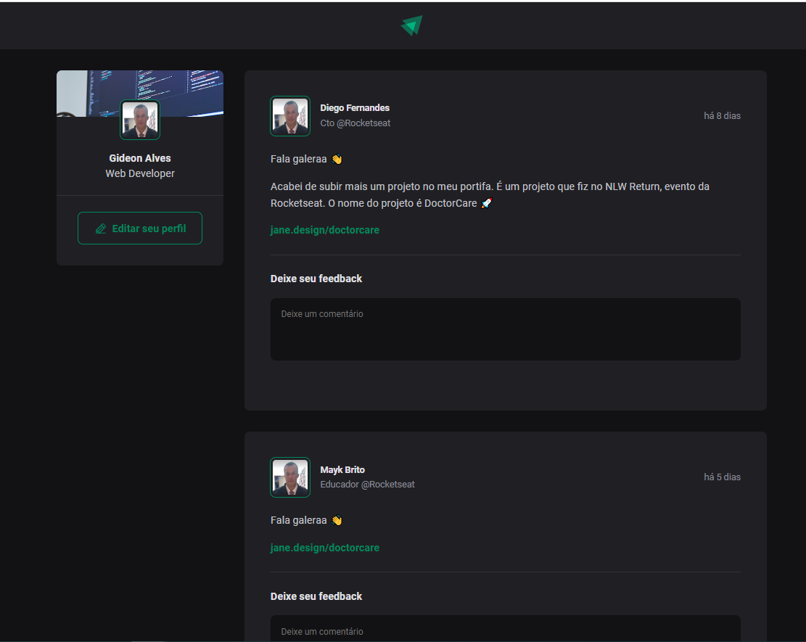

# IgniteFeed

Ignite feed é um projeto simples que simula o feed das redes sociais,  com funcionalidades de comentários, likes e apagar comentário.

  

## Funcionalidades

Este projeto foi desenvolvido com as seguintes tecnologias:

<ul>
  [x] - adicionar comentários 
  [x] - aplaudir (likes) 
  [x] - apagar comentário 
</ul>

## Como usar

1. Clonar repositório
     ``git clone https://github.com/gideonalves/IgniteFeed.git``

2. Navegue até o repositório
   ``cd ignite-feed``

3. Instalar dependências
``npm install``

4. Execute a aplicação em modo de desenvolvimento
   ``npm run dev``

6. A aplicação será aberta na porta:3000 - acesse 
   ``http://localhost:3000``

## Tecnologias utilizadas

Este projeto foi desenvolvido com as seguintes tecnologias:

- [Vite](https://vitejs.dev/)
- [HTML](https://developer.mozilla.org/pt-BR/docs/Web/HTML)
- [CSS](https://www.w3.org/Style/CSS/Overview.en.html)
- [ReactJS](https://pt-br.reactjs.org/)
- [Typescript](https://www.typescriptlang.org/)

## Considerações finais

## Desenvolvido por ``Gideon Alves``